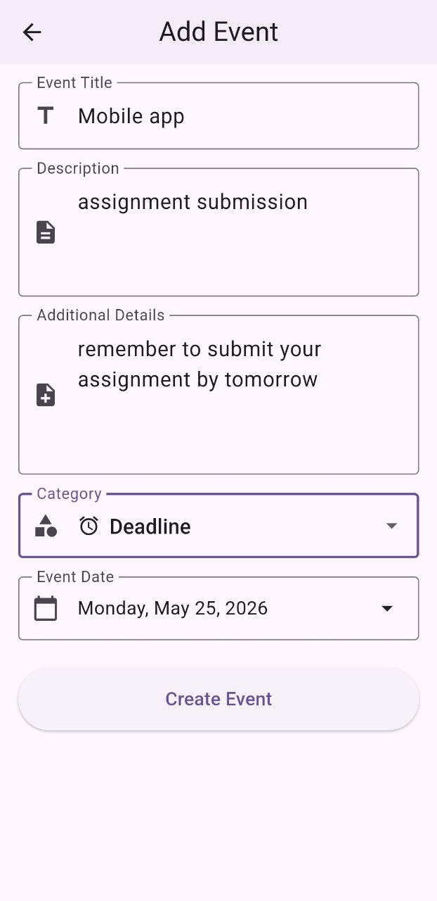
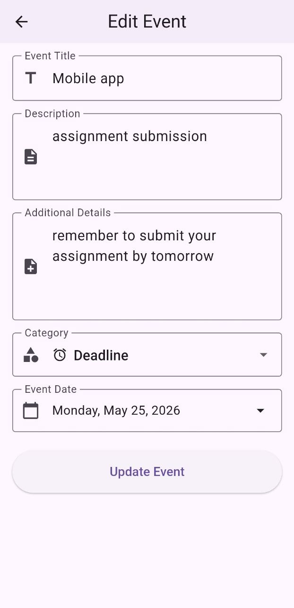
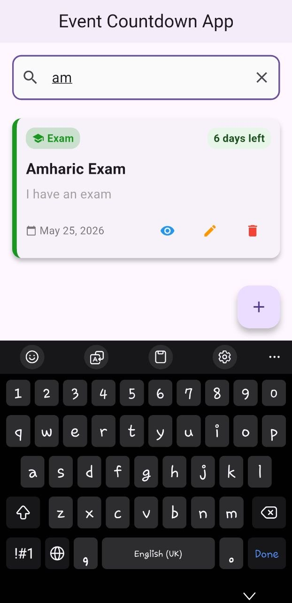
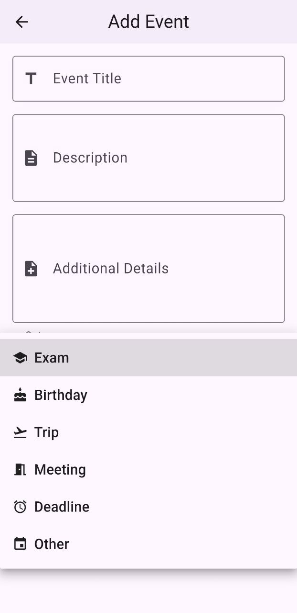
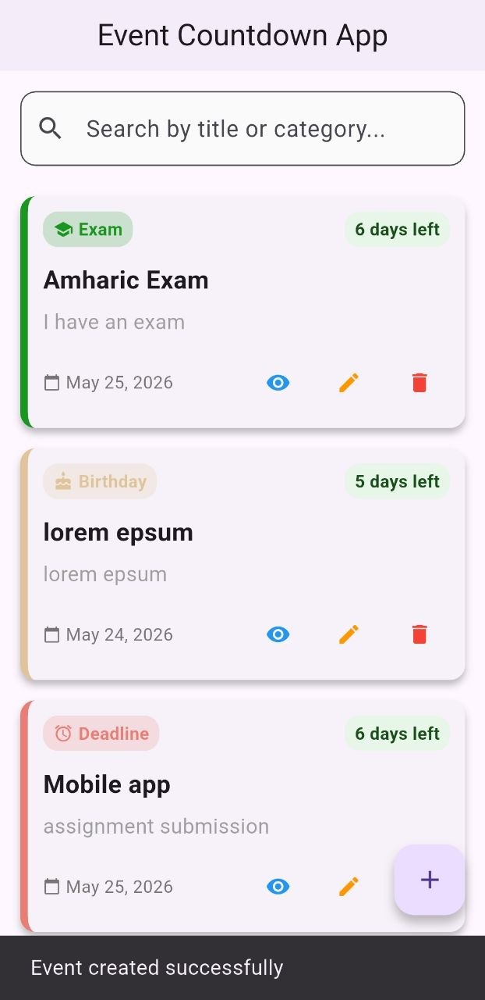
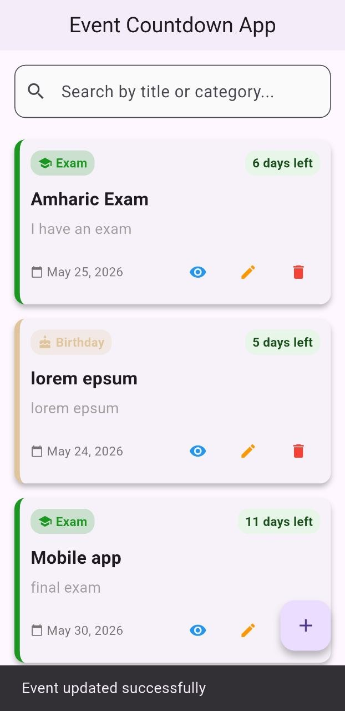
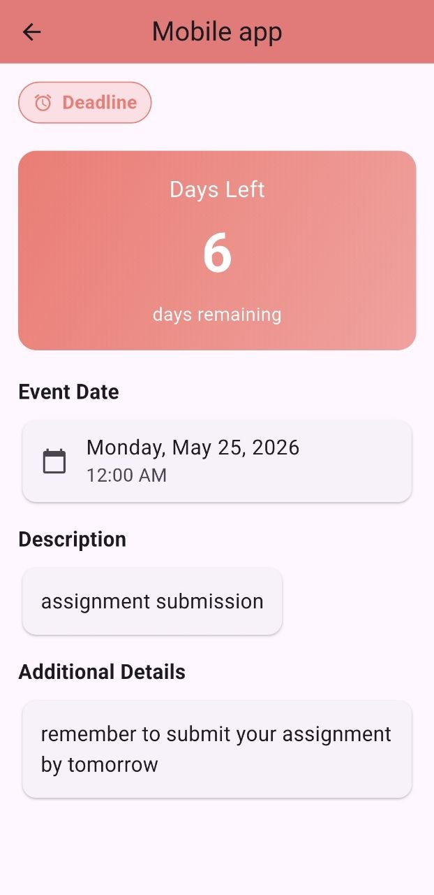

# Event Countdown App

A modern Flutter application for managing and tracking important events with countdown timers.

This app allows users to create, edit, view, and delete events while organizing them into categories such as birthdays, exams, deadlines, meetings, and more.

Built using Flutter, Provider for state management, and the http package for API consumption(mockapi.io).

---

## Features

- Add new events
- Edit existing events
- Delete events
- View all events
- View detailed event information
- Real-time countdown timer for each event
- Event categories:
  - Birthday
  - Exam
  - Deadline
  - Meeting
  - Trip
  - Others
- CRUD API integration using http
- State management using Provider
- Loading and error handling states
- Clean and maintainable project structure

---

## Technologies Used

- Flutter
- Dart
- Provider
- HTTP Package
- REST API (mockapi.io)

---

## Project Structure

```bash
lib/
│
├── models/
├── providers/
├── services/
├── screens/
├── widgets/
├── utils/
└── main.dart
```

---

## Screenshots


### Add Event Screen


### Delete Event


### Edit Event Screen


### Search Event 


### Select Event Category 


### View All Added Events 


### View Edited Events 


### View Event Detail Screen

---

## Getting Started

### Prerequisites

Make sure you have installed:

- Flutter SDK
- Dart SDK
- Android Studio or VS Code

---

### Installation

1. Clone the repository

```bash
git clone https://github.com/your-username/event-countdown-app.git
```

2. Navigate to the project folder

```bash
cd event-countdown-app
```

3. Install dependencies

```bash
flutter pub get
```

4. Run the application

```bash
flutter run
```

---

## API Used

This project uses a public REST API known as MockAPI for performing CRUD operations.

---

## Author

Hayat Abdulkerim  
UGR/0826/16

---

## License

This project is for educational purposes only.
